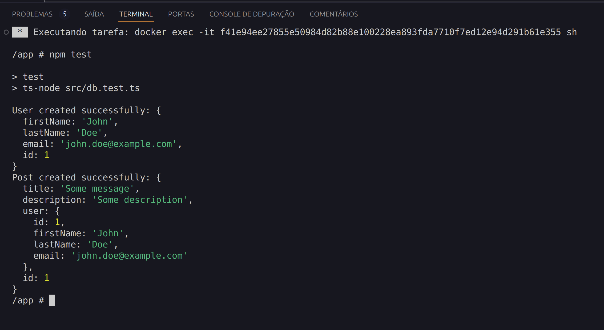

# 👨‍💻 Realização do teste da Water Services and Technologies para Vaga de Desenvolvedor Jr.

## Contextualização!
⚠️ Segue as descrições do que foi requisitado e as seguintes resoluões, dentro do escopo requisitado

## 1º Passo: Criação das Tabelas no `init.sql`
<details>
<summary>Dentro do arquivo `init.sql`, crie as seguintes tabelas:</summary><br />

### Tabela `user`
- **id** – Tipo: `Int`, autoincremental, chave primária (PK).
- **firstName** – Tipo: `Varchar(100)`, não nulo.
- **lastName** – Tipo: `Varchar(100)`, não nulo.
- **email** – Tipo: `Varchar(100)`, não nulo.

### Tabela `post`
- **id** – Tipo: `Int`, autoincremental, chave primária (PK).
- **title** – Tipo: `Varchar(100)`, não nulo.
- **description** – Tipo: `Varchar(100)`, não nulo.
- **userId** – Tipo: `Int`, não nulo (chave estrangeira referenciando a tabela `user`).
</details>

### ✅ Resolução 01

```sql
USE test_db;

CREATE TABLE IF NOT EXISTS user (
    id INT AUTO_INCREMENT PRIMARY KEY,
    firstName VARCHAR(100) NOT NULL,
    lastName VARCHAR(100) NOT NULL,
    email VARCHAR(100) NOT NULL
);

CREATE TABLE IF NOT EXISTS post (
    id INT AUTO_INCREMENT PRIMARY KEY,
    title VARCHAR(100) NOT NULL,
    description VARCHAR(100) NOT NULL,
    userId INT NOT NULL,
    FOREIGN KEY (userId) REFERENCES user(id) ON DELETE CASCADE
);
```
---

## 2º Passo: Criação das Entidades `User` e `Post`

Dentro da pasta `src/Entity`, crie as entidades correspondentes às tabelas `User` e `Post`.

### ✅ Resolução 02:
#### Entidades `src/entity/Post.ts`:
```javascript
import { Entity, PrimaryGeneratedColumn, Column, ManyToOne } from "typeorm";
import { User } from "./User";

@Entity()
export class Post {
  @PrimaryGeneratedColumn()
  id: number | undefined;

  @Column({ type: "varchar", length: 100 })
  title: string | undefined;

  @Column({ type: "varchar", length: 100 })
  description: string | undefined;

  @ManyToOne(() => User, (user) => user.posts, { onDelete: "CASCADE" })
  user: User | undefined;
}
```

#### Entidades `src/entity/User.ts`:
```javascript
import { Entity, PrimaryGeneratedColumn, Column, OneToMany } from "typeorm";
import { Post } from "./Post";

@Entity()
export class User {
  @PrimaryGeneratedColumn()
  id: number | undefined;

  @Column({ type: "varchar", length: 100 })
  firstName: string | undefined;

  @Column({ type: "varchar", length: 100 })
  lastName: string | undefined;

  @Column({ type: "varchar", length: 100, unique: true })
  email: string | undefined;

  @OneToMany(() => Post, (post: { user: any; }) => post.user)
  posts: Post[] | undefined;
}
```
---

## 3º Passo: Configurar endpoints `users` e `posts`

Dentro de `src/index.ts`, configure dois endpoints `users` & `posts`
### ✅ Resolução 03:
#### Endpoint `users`:
```javascript
app.post('/users', async (req, res) => {
  const { firstName, lastName, email } = req.body;
  const userRepository = AppDataSource.getRepository(User);

  try {
    const newUser = userRepository.create({ firstName, lastName, email });
    await userRepository.save(newUser);
    res.status(201).json(newUser);
  } catch (error) {
    console.error("Error creating user:", error);
    res.status(500).json({ message: "Error creating user" });
  }
});
```
#### Endpoint `posts`
```javascript
app.post('/posts', async (req, res) => {
  const { title, description, userId } = req.body;
  const postRepository = AppDataSource.getRepository(Post);
  const userRepository = AppDataSource.getRepository(User);

  try {
    const user = await userRepository.findOneBy({ id: userId });
    if (!user) {
      return res.status(404).json({ message: "User not found" });
    }

    const newPost = postRepository.create({ title, description, user });
    await postRepository.save(newPost);
    res.status(201).json(newPost);
  } catch (error) {
    console.error("Error creating post:", error);
    res.status(500).json({ message: "Error creating post" });
  }
});
```
---


## 4º Passo: Configuração do Dockerfile

Configure o `Dockerfile` da aplicação para garantir que ela seja construída corretamente no ambiente Docker.

### ✅ Resolução 04:
```javascript
FROM node:22.11-alpine3.20

WORKDIR /app

COPY package*.json ./

RUN npm install

COPY . .

RUN npm run build

EXPOSE 3000

CMD ["npm", "start"]
```
---

## 5º Passo: Teste da Aplicação

Execute os seguintes comandos para testar a aplicação:

1. **Subir a aplicação utilizando Docker Compose**:
   ```bash
   docker compose up --build
   docker exec -it <Container Name> /bin/sh
   
   ```

   Dentro do container, execute o teste:
   ```bash
   npm test
   ```

### ✅ Resolução 05:


## 6º Passo: Crie um fork desse repositório e submita o código preenchido nele.
Crie um Pull Request para a brach master nos enviando o código

✅ Realizado


# Conclusão

😉 Fico a disposição para novos desafios ou tirar duvidas.

## ☎️ `Segue meus contatos:`


  🔗 Conecte-se comigo no <a href="https://linkedin.com/in/andre-bacelar-goncalves" target="_blank" rel="noopener">LinkedIn</a>
  
  ✉️ E-mail: [andrebgsi@gmail.com](mailto:andrebgsi@gmail.com)

  🌐 Acessar meu portfólio <a href="http://andrebg.com.br/" target="_blank" rel="noopener">andrebg.com.br</a>

  👨‍💻 GitHub <a href="https://github.com/Andrebgsi" target="_blank" rel="noopener">@Andrebgsi</a>